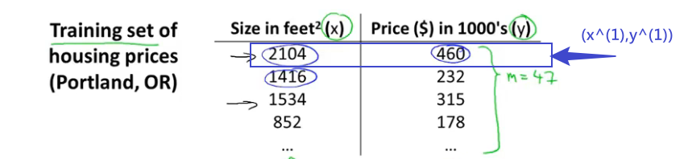
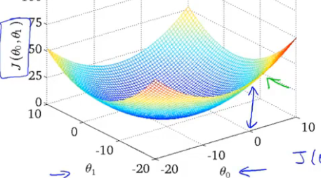
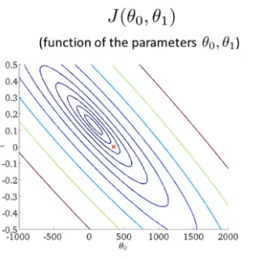
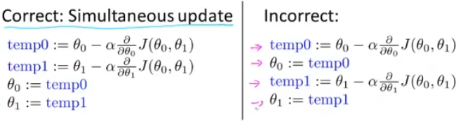
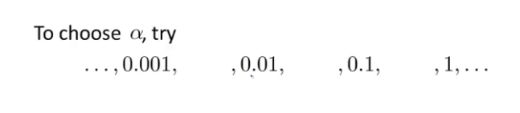
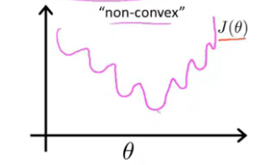
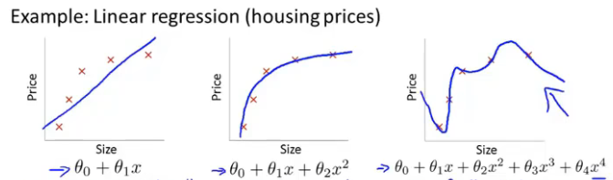
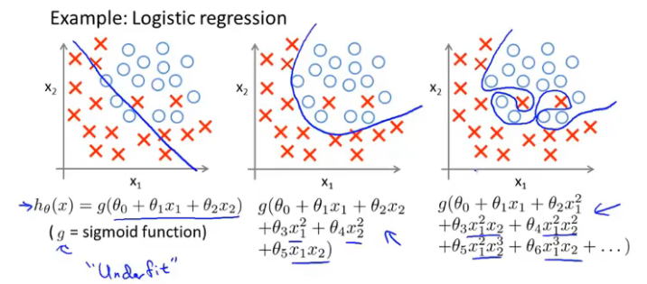
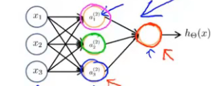
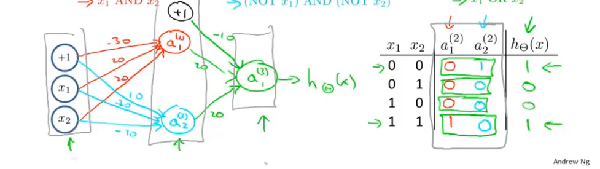

# 监督学习

根据已经标记过的数据集，预测之后的结果

## 回归算法

### 线性回归

对一堆离散的数据进行曲线的拟合，称这样的问题为回归问题

-  m ：训练数据的数量
- x‘s ： 输入（**特征feature** ）
- y’s ：输出（target variable 目标变量）
- (x,y)  = 一个训练样本
- $(x^{(i)},y^{(i)})$ = 表示第i个训练样本
- h = 假设函数(hypothesis function) 
- 称所有的训练样本为数据集

如：

对于假设函数是一次函数（$h(x) = \theta_0 + \theta_1 x$）的回归问题，称为**线性回归**

### 代价函数

- $\theta_i$：模型参数

- 代价函数(Cost function)：$J(\theta_0,\theta_1) = \frac{1}{2m}\sum_{i=1}^{m}(h_{\theta}(x^{(i)})-y^{(i)})^2 \\$

  类似**方差**，计算目标变量和训练样本的偏差，为了使假设尽可能的准确，求该函数的**最小值**即可，将该操作记为${\min}_{\theta_0,\theta_1} J(\theta_0,\theta_1)\\$

  

可以将该图投影到平面上，即做该三维图像的**等高线图**。

### 梯度下降

**梯度下降**法是一种用来求代价函数**最小值**和**最小值点**的方法，即${\min}_{\theta_0,...,\theta_n} J(\theta_0,...,\theta_n)\\$

根据高等数学，**方向导数**的知识，导数指明了斜率（变化的趋势），我们只需要让参数跟随这个趋势变化，直到导函数为0即可。
$$
\theta_j := \theta_j - \alpha \frac{\part J}{\part \theta_j}
$$

- 其中$:=$表示赋值

- 值得注意的是，如果我们每做一次这个操作就赋值一次，会对原函数产生影响，所以选择对每一个自变量都求完偏导之后再进行赋值，即

  

- $\alpha$称为学习率，他决定了下降的速度快慢 

- 显然，使用“-”可以让我们收敛到最低点，如果使用“+”，我们就可以收敛到最高点。

### 线性回归的梯度下降

将线性的假设函数代入梯度下降算法，可以得到
$$
\theta_0 = \theta_0 - \alpha \frac{1}{m}\sum_{i=1}^{m}(h_{\theta}(x^{i} )-y^{(i)})\\
\theta_1 = \theta_1 - \alpha \frac{1}{m}\sum_{i=1}^{m}(h_{\theta}(x^{i} )-y^{(i)})\cdot x^{(i)}
$$

### 多元线性回归/梯度下降

当有多个特征值时
$$
h_{\theta}(x) = \theta_0+\theta_1x_1 + ...+\theta_n x_n\\
令 x = \begin{bmatrix}
x_0\\
x_1\\
\vdots\\
x_n
\end{bmatrix}
\theta=\begin{bmatrix}
\theta_0\\
\theta_1\\
\vdots\\
\theta_n
\end{bmatrix}
\\
h_{\theta}(x) = \theta^Tx
$$

- 规定$x_0 = 1$

- 代价函数可以写作

  $h_\theta(x) = \theta_j - \frac{\part J(\theta)}{\part \theta_j} =\theta_j - \alpha \frac{1}{m}\sum_{i=1}^m(h_{\theta}(x^{(i)})-y^{(i)}) x_j^{(i)}\\$

  - 其中$\theta 是向量$
  - $x_j^{(i)}$表示第i组数据的第j个特征

### 特征缩放

感觉有点像离散化的思想

对于一个特征变化范围特别大，而另一个特征变化范围比较小的情况下的梯度下降，会导致下降的速度十分的缓慢，因此可以通过特征缩放的方法，加快最小值的求解

更加一般的，常将特征收缩到**[-1,1]的范围**内，或者比较接近这个范围

**归一化**

大量的特征值似乎服从**正态分布**，所以将所有的特征值，进行变换$x_i=\frac{x_i-\mu_i}{\sigma_i}\\$

### 学习率

当迭代出现了一定的异常时，可以尝试较小的学习率

直到求出的值是收敛的

### 特征和多项式回归

显然的，多项式可以拟合任意的曲线（**泰勒展开**），所以当出现线性回归无法处理的任务时，可以选择使用多项式的方式进行拟合

- 多项式回归中，特征的缩放显得更加重要

### 正规方程

对于m个**样本**$(x^{(1)},y^{(1)}),...(x^{(m)},y^{(m)})$，每个x有n个**特征**
$$
x^{(i)} = \begin{bmatrix}
x_0^{(i)}\\
\vdots\\
x_n^{(i)}
\end{bmatrix} \in \R^{n+1}
 \quad X_{m\cp (n+1)} = \begin{bmatrix}
 1,(x^{(1)})^T\\
 \vdots
 \\1,(x^{(m)})^T
 \end{bmatrix} \quad y = \begin{bmatrix}
 y^{(1)}\\
 y^{(2)}\\
 \vdots
 \\
 y^{(n)}
 \end{bmatrix}
$$
 则$\theta = (X^TX)^{-1}X^Ty$即为所求

$X^TX$何时不可逆

- 两个列向量之间能线性表示
- 特征太多，甚至多余样本个数

### 正规方程法和梯度下降法的对比

梯度下降

- 需要选$\alpha$
- 需要很多次迭代
- n很大时，效果依然很好

正规方程

- 时间复杂度大，n很大时效果不好
- 不需要迭代
- 不需要选择$\alpha$

## 分类

### Logistic 回归

$$
logistic(sigmoid) \quad function\\
g(x) =  \frac{1}{e^{-x}+1}\\
令x=\theta^Tx 得到 h_{\theta}(x) = \frac{1}{e^{-\theta^T x} +1}
$$

- 这个函数的值处在0和1之间
- 表示给定x和$\theta$时y=1的估计概率，即$p(y=1|x;\theta)$
- 当$h_\theta(x) \ge 0.5$时认为y=1的概率较大
- 由于$h_\theta(0)=0.5$，且该函数为单调递增函数，所以$h_\theta(x) \ge 0.5 \Leftrightarrow x >0$
-  称$\theta^Tx=0$所确定的范围为**决策界限**

### 损失函数

训练样本
$$
\{(x^{(1)},y^{(1)}),...,(x^{(m)},y^{(m)})\}
$$
特征
$$
x\in\begin{bmatrix}
x_1\\
\vdots\\
x_n
\end{bmatrix}
x_0\in 1,y\in \{0,1\}
$$
如何确定假设函数$h_\theta(x)$中的参数$\theta$?

如果按照之前的线性的方法，得到的函数有可能会是这样

由于**假设函数**不是一个线性函数，所以得到的$J(\theta)$这个函数图像有很多的局部最优解，导致梯度下降的效果不是很好，所以我们可以这样定义**代价函数**
$$
Cost(h_\theta(x),y)=\begin{cases}
-\log(h_\theta(x))\quad &y=1\\
-\log(1-h_\theta(x))\quad& y=0
\end{cases}
$$

- 首先，我们注意到这个函数对于我们描述真实值和预测值之间的差距是很准确的，当预测值和真实值没有差距时，函数的值为0，而当预测值和实际值一个为0另一个为1时，函数趋向于无穷

### 简单的代价函数和梯度下降

通过前面的定义，逻辑回归的损失函数如下
$$
J(\theta) = \frac{1}{m}\sum_{i=1}^{m}Cost(h_\theta(x^{(i)}),y^{(i)})\\
Cost(h_\theta(x),y)=\begin{cases}
-\log(h_\theta(x))\quad &y=1\\
-\log(1-h_\theta(x))\quad& y=0
\end{cases}\quad y\in\{0,1\}
$$
可以得出，这个式子等价于（通过构造的方法）
$$
Cost(h_\theta(x),y) = -y\log (h_\theta(x))-(1-y)\log(1-h_\theta(x))
$$
从而
$$
J(\theta)=-\frac{1}{m}[\sum_{i=1}^my^{(i)}\log h_\theta(x^{(i)})+(1-y^{(i)})\log( 1-h_\theta{(x^{(i)})}  )]
$$
下面考虑用梯度下降的方法求使得$J(\theta)$取得最小值时的$\theta$的值，求偏导之后惊奇的发现
$$
\theta_j = \theta_j - \alpha \sum_{i=1}^{m}(h_\theta(x^{(i)})-y^{(i)})x_j^{(i)}
$$
这个式子和线性回归的式子是一样的，不一样的地方在于，这个式子的**假设函数**，用的不是**线性函数**，而是(**sigmoid函数**)

### 优化算法

### 多类别分类

逻辑回归只适用于两个类别，对于多个类而言，我们需要做的仅仅是增多**假设函数的个数**，使他能够将一类与其他的类别区分出来，对于每一个假设函数，我们都能区分出一类，最终能将他们全部区分开，即
$$
\max _ih_\theta^{(i)}(x)
$$
表明这个样本**最有可能**属于那一个类别

## 正则化

### 过拟合问题

欠拟合：一个曲线对实际值的拟合有很大误差

过拟合：符合几乎所有数据样本点，但是实际上**无法做出准确预测**（类似荣格现象）

解决过拟合的措施：

1. 减少特征的个数（舍弃作用不大的特征）（降维）
2. 正则化

### 正则化的Cost函数

就是对我们的代价函数添加一些修正项（惩罚项），使得某些**特征的参数较小**，当我们不知道哪一个特征起主要作用的时候，常常对所有的参数（不对第一个参数进行正则化操作，这是一个约定，工程上不会产生很大的影响），即
$$
J(\theta) =\frac{1}{2m} [\sum_{i=0}^{m}(h_\theta(x^{(i)})-y^{(i)})^2+\lambda \sum_{j=1}^{m}\theta_j^2]
$$
称上面修正过后的$\lambda$为**正则化参数**，额外添加的哪一项被称为**正则化项**

### 线性回归的正则化

对于正则化Cost函数的梯度下降法，将添加正则化项的代价函数代入梯度下降法中，得到
$$
\theta_j = \theta_j - \alpha [\frac{1}{m}\sum_{i=1}^{m}(h_\theta^{(i)}(x)-y^{(i)})x_j^{(i)}]+\frac{\lambda}{m}\theta_j
$$
对于正规方程的方法，一样可以添加正则化项，即
$$
\theta = (X^TX +\lambda\begin{bmatrix}0 & \dots & 0 \\ \vdots & 1 &\vdots \\ 0&\dots&1\end{bmatrix} )^{-1}X^Ty
$$

### 逻辑回归的正则化

和线性回归的正则化一眼，我们只需要在Cost函数后面添加一个惩罚项就好了，前面介绍逻辑回归的时候使用梯度下降法求得的结果和线性回归的结果是相似的，因此添加惩罚项之后结果依然是相似的、

## 神经网络

### 神经网络处理分类问题

激活函数（activation function）：$g(z) = \frac{1}{1+e^{-z}}\\$

激活项：

$a^{(j)}_i$：表示第j层的第i个激活项，是处理单元的输出

$z^{(j)}_i$：表示第j层第i个单元的输入

$\Theta^{(j)}$：第j层的权重矩阵，是一个映射（从第j层到第j+1层）

- 网络的结构由一个输入层（**激活层**），一个输出层，和若干隐藏层构成，可以通过**向前传播**通过多个输入的特征，得到假设函数

- 网络第j层有$s_j$个单元，第j+1层有$s_{j+1}$个单元，那么他就是一个$s_{j+1}\times (s_j + 1)$的矩阵

- 经过权重矩阵的处理，上一层的输出矩阵变成下一层的输入矩阵

  如

  

  第一层的输出为，向量$x=\begin{bmatrix}x_0\\ \vdots \\ x_n\end{bmatrix}$，权重矩阵为$\Theta^{(1)}=\begin{bmatrix}\Theta_{10}^{(1)} &\dots &\Theta^{(1)}_{13}\\ \vdots & \dots & \vdots \\ \Theta^{(1)}_{30}&\dots&\Theta_{33}^{(1)}\end{bmatrix}$

  那么第2层的输入为$z=\Theta^{(1)}x$

  实际上第一层只有n个元素，$x_0$是额外添加的，为1，称这个额外增加的项为**偏置单元**

**向前传播：**
$$
a^{(1)}=x\\
add \quad a_{0}^{(1)}=1\\
z^{(2)}=\Theta^{(1)}a^{(1)}\\
a^{(2)}=g(z^{(2)})
$$
直到得到$h_\Theta(x)$

**非线性分类的例子**：XOR/XNOR（异或，同或）

### 多类别分类

多类别分类需要在原来1个输出的基础上拓展成多个，即有**多个输出单元**。假设我们要分n个类，那么n个输出可以用一个向量来表示，同时，我们给定的样本也应该使用n维向量的形式。

### 代价函数

样本：
$$
\set{(x^{(1)},y^{(1)}),(x^{(2)},y^{(2)}),(x^{(3)},y^{(3)}),...,(x^{(m)},y^{(m)})}
$$
L：神经网络的总层数（包含输入层和输出层以及隐藏层）

$s_l$：第l层的单元个数（不包含偏置单元）

K：输出的单元个数

将逻辑回归中的代价函数进行扩展，得到
$$
J(\Theta)=-\frac{1}{m}[\sum_{i=1}^{m}\sum_{i=1}^Ky^{(i)}_k\log({h_\Theta(x^{(i)})})_k+(1-y^{(i)}_k)\log({1-(h_\Theta(x^{(i)}))_k})] +\frac{\lambda}{2m}\sum_{i=1}^{L-1}\sum_{i=1}^{s_l}\sum^{s_l+1}_{j=1}(\Theta^{(l)}_{ji})^2
$$

- $h_\Theta(x)\in \R^K,(h_\Theta(x))_i$表示第i个输出
- 上面两个连加号的含义是，将所有单元的代价函数进行相加
- 下面三个连加号的含义是将所有层（不包含输出层）中的权重矩阵中的每一项进行相加

### 反向传播算法

反向传播算法是求让$J(\Theta)$最小的$\Theta$矩阵的算法

定义：$\delta^{(l)}_j$是第l层的第j个结点的误差

对每一个输出单元，在最后一层，设输出层是第四层，$\delta^{(4)}_{j} = a^{(4)}_j-y_j$

第一层没有误差，对于中间的两层
$$
\delta^{(i)} = (\Theta^{(i)})^T\delta^{(i+1)} \cdot g'(z(i))
$$
总结：

训练集：$\set{(x^{(1)},y^{(1)}),...,(x^{(m)},y^{(m)})}$

### 梯度检验

是一个求导数的数值方法
$$
\theta \in \R ^n \\ \theta = \begin{bmatrix}\theta_1,\theta_2,\dots,\theta_n\end{bmatrix}\\
\frac{\partial}{\part \theta_1}J(\theta) \sim \frac{J(\theta_1+\varepsilon,\theta_2,\dots,\theta_n) - J(\theta_1-\varepsilon,\theta_2,\theta_3,\dots,\theta_n)}{2\varepsilon}\\ \vdots
$$
利用和导数定义类似的方法

### $\Theta$的初始化

1. 初始化为0不能起到任何作用

2. 使用随机初始化的思想

   对于每一个$\Theta^{(l)}_{ij}$，随机初始化为$[-\epsilon,\epsilon]$之间的一个数值

### 总结

- 输出层和输入层根据实际需要选择
- 隐藏层通常可以选择一层
- 不止一层时，通常会使每一层拥有相同的单元数
- 隐藏单元通常来说越多越好，但是会增大计算量，通常选择为输入层的二倍

神经网络实现的步骤：

1. 随机初始化权重，通常选择接近0的随机值
2. 使用向前传播算法
3. 计算代价函数
4. 运行向后传播算法 
5. 梯度检验，确保反向传播算法得到的偏导值和梯度检验差不多
6. 用优化方法求解

## 趋势检验

### Mann-Kendall检验

MK算法可以获得检验时序数据的大致趋势，分为无明显趋势（稳定）、趋势上升或者下降

1. 没有趋势时，随时间获得的数据是独立同分布的，数据随时间不是连续相关的
2. 对数据的分布没有要求
3. 缺失部分值时也能做出判断
4. 假设数据是独立同分布的

**原理**

- 假设：$H_0$没有单调趋势，$H_a$为有单调趋势

- 数据按照采集时间依次取出，为$X=\set{x_1,\dots,x_n}$

- 确定所有$\frac{n(n-1)}{2}$个$x_i-x_j$的差值函数$f(x_i-x_j)$（$n\ge i>j\ge 1$）
  $$
  f(x_i-x_j)=\begin{cases}
  -1&x_i-x_j<0\\
  0 &x_i-x_j=0\\
  1&x_i-x_j >0\\
  \end{cases}
  $$
  或者某个值因为没有检测（数据确实）而不能确定

- 计算公式$S$的值，即为差值为正的数量减去差值为负的数量
  $$
  S=\sum_{i=1}^{n-1}\sum_{i=j+1}^{n}f(x_i-x_j)
  $$
  S>0：后一部分的观测值相比于之前的观测值会趋向于变大

  S<0：后一部分的观测值相比于之前的观测值趋向于变小

- 当n<10时，查概率表
  $$
  z=\frac{S}{\frac{n(n-1)}{2}}
  $$
  n>10

  若数据中每个数都是唯一的
  $$
  VAR(S)=\frac{1}{18}n(n-1)(2n+5)
  $$
  若数据中存在的数据不唯一
  $$
  VAR(S) = \frac{1}{18}[n(n-1)(2n+5)-\sum_{p=1}^gt_p(t_p-1)(2t_p+5)]
  $$
  其中p为重复数的数量，g为唯一数的数量（结组数），$t_p$为每个重复数出现的次数
  $$
  z=\begin{cases}
  \frac{S-1}{\sqrt{VAR(S)}}&S>0\\
  0&S=0\\
  \frac{S+1}{\sqrt{VAR(S)}}&S<0
  \end{cases}
  $$
  错误率为$\alpha ,0<\alpha<0.5$
  $$
  |z| \ge Z_{1-\frac{\alpha}{2}}
  $$
   则表示拒绝$H_0$

**方法评价**

- 适用性强，不需要数据服从什么分布
- 不受少数极值的影响
- 速度较快
- 不受缺失数据的影响

# 无监督学习

对一个数据集进行分类

# 代码编写技巧

- 常常将一个for循环简化成为一个向量运算
